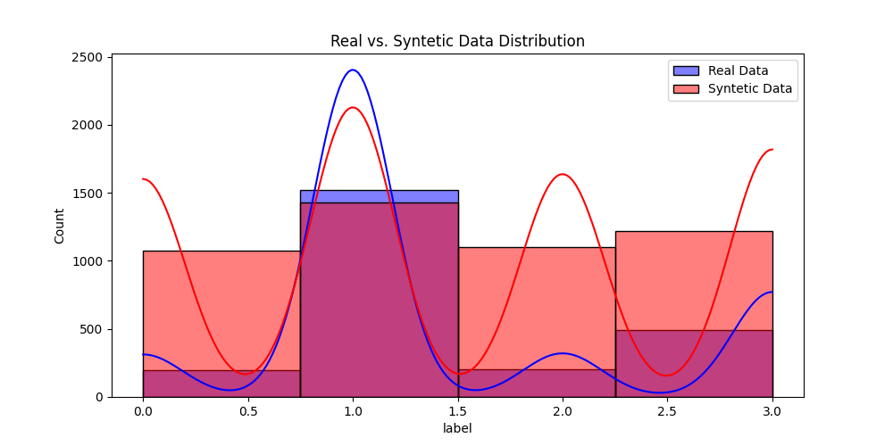

# EASE2025 - Privacy-Preserving Methods for Bug Severity Prediction

## Overview
Bug severity prediction is a crucial task in software engineering, enabling more efficient resource allocation and prioritization in software maintenance. AI-based models significantly benefit from extensive datasets, but industrial applications face challenges due to data-sharing constraints and the limited availability of labeled data.

In this study, we investigate method-level bug severity prediction using source code metrics and Large Language Models (LLMs) with two widely used datasets. We compare the performance of models trained using centralized learning, federated learning, and synthetic data generation. Our results indicate that models trained with federated learning and synthetic data achieve comparable results to centrally trained models while preserving data privacy. This highlights the potential of privacy-preserving approaches to facilitate bug severity prediction in industrial contexts where data sharing is a significant challenge.

## Key Contributions
- Investigating method-level bug severity prediction using source code metrics and LLMs.
- Evaluating centralized learning, federated learning, and synthetic data generation.
- Demonstrating that federated learning and synthetic data can achieve comparable performance to centralized models without sharing sensitive data.
- Providing insights into privacy-preserving AI applications in software defect prediction.

## Datasets
We utilize two widely recognized software defect datasets in our study:
- **Dataset Source:** [ISSRE2023-BugSeverityPrediction](https://github.com/EhsanMashhadi/ISSRE2023-BugSeverityPrediction)
- These datasets contain labeled bug severity information, enabling method-level prediction using various AI models.

## Methodology
1. **Feature Extraction**: Source code metrics are extracted to serve as input features.
2. **Model Training Approaches**:
   - **Centralized Learning:** Training models on a fully accessible dataset.
   - **Federated Learning:** Training models across distributed datasets without sharing raw data.
   - **Synthetic Data Generation:** Training models with generated data to mitigate data-sharing limitations and unbalanced data distributions.
3. **Evaluation Metrics**: The models are assessed based on classification metrics such as f1, kappa score, mcc and g-mean.

## Results

